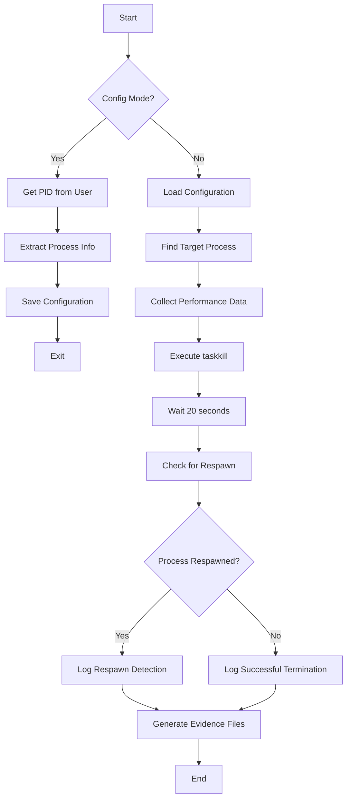

# 🔍 COPEC Hunter - Process Monitor & Respawn Detector

A PowerShell script that monitors Windows processes, tracks their PID changes after termination, and detects automatic respawning behavior. Originally designed for COPEC Worker processes, now supports any Windows process. Perfect for analyzing process persistence, debugging service restarts, or monitoring application recovery mechanisms.

## 🚀 Features

- **Dynamic Process Configuration**: Configure any process to monitor by providing its PID
- **PID Tracking**: Monitors process before and after `taskkill` execution  
- **Respawn Detection**: Automatically detects if a process restarts after termination
- **Performance Monitoring**: Collects CPU and memory usage statistics
- **Comprehensive Logging**: Detailed logs with timestamps and JSON evidence files
- **Evidence Collection**: Saves complete process information for analysis
- **Flexible Search**: Supports both CommandLine and ProcessName-based detection

## 📋 Requirements

- **Windows 10/11** or **Windows Server 2016+**
- **PowerShell 5.1** or later
- **Administrator privileges** (recommended for full process access)

## 🛠️ Installation

1. **Clone the repository:**
```bash
git clone https://github.com/jrmreis/copec-hunter.git
cd copec-hunter
```

2. **Set execution policy** (if needed):
```powershell
Set-ExecutionPolicy -ExecutionPolicy RemoteSigned -Scope CurrentUser
```

## 🎯 Quick Start

### Step 1: Configure Target Process

First, identify the PID of the process you want to monitor, then configure the script:

```powershell
.\copec_hunter.ps1 -config
```

**Example configuration session:**
```
=== CONFIGURAÇÃO DO PROCESSO ALVO ===
Digite o PID do processo que deseja monitorar: 5432

Buscando processo com PID: 5432...

=== INFORMAÇÕES DO PROCESSO ENCONTRADO ===
PID: 5432
Nome: notepad.exe
Executável: C:\Windows\System32\notepad.exe
Linha de Comando:
  "C:\Windows\System32\notepad.exe" C:\temp\test.txt
=============================================

Confirma esta configuração? (S/N): S

=== CONFIGURAÇÃO SALVA COM SUCESSO ===
```

### Step 2: Run Monitoring

Execute the monitoring process:

```powershell
.\copec_hunter.ps1
```

The script will:
1. 🔍 Find the configured process type
2. 📊 Collect performance data
3. ⚡ Execute `taskkill` on the process
4. ⏱️ Wait 20 seconds monitoring for respawn
5. 📝 Generate detailed reports

## 📊 Usage Examples

### Example 1: Monitor Notepad
```powershell
# Step 1: Open notepad and get its PID
Get-Process notepad

# Step 2: Configure monitoring
.\copec_hunter.ps1 -config
# Enter the notepad PID when prompted

# Step 3: Run monitoring
.\copec_hunter.ps1
```

### Example 2: Monitor a Service Worker
```powershell
# Find your service process
Get-CimInstance Win32_Process | Where-Object {$_.CommandLine -like "*yourservice*"}

# Configure with the PID
.\copec_hunter.ps1 -config

# Monitor
.\copec_hunter.ps1
```

## 📁 Output Files

The script creates organized output in the `logs` directory:

```
logs/
├── process_config.json              # Configuration file
├── process_monitor.log              # Main execution log
├── process_pid_before_taskkill_*.json   # Pre-termination evidence
├── process_pid_after_respawn_*.json     # Post-respawn evidence (if detected)
└── process_pid_no_respawn_*.json        # No-respawn evidence
```

### Configuration File Structure
```json
{
  "ConfiguredAt": "2025-07-11 10:30:15.123",
  "ConfiguredBy": "username",
  "Computer": "WORKSTATION01",
  "SourcePID": 5432,
  "ProcessName": "notepad.exe",
  "ExecutablePath": "C:\\Windows\\System32\\notepad.exe",
  "CommandLinePattern": "\"C:\\Windows\\System32\\notepad.exe\" C:\\temp\\test.txt",
  "SearchMethod": "CommandLine"
}
```

### Evidence File Structure
```json
{
  "Phase": "BEFORE_TASKKILL",
  "PID": 5432,
  "ProcessName": "notepad.exe",
  "CommandLine": "\"C:\\Windows\\System32\\notepad.exe\" C:\\temp\\test.txt",
  "CreationDate": "20250711103000.123456-180",
  "Performance": {
    "CPUUsagePercent": 0.15,
    "WorkingSetMB": 12.5,
    "VirtualMemoryMB": 45.2,
    "HandleCount": 156,
    "ThreadCount": 3
  }
}
```

## 🔧 Command Line Options

| Option | Description | Example |
|--------|-------------|---------|
| `-config` | Configuration mode to set target process | `.\copec_hunter.ps1 -config` |
| *(no params)* | Run monitoring with saved configuration | `.\copec_hunter.ps1` |

## 📊 Performance Metrics Collected

- **CPU Usage**: Real-time CPU percentage
- **Memory Usage**: Working Set, Virtual Memory, Paged/Non-paged
- **Process Info**: Handle count, thread count, priority class
- **Timing**: Creation time, termination time, respawn detection time

## ⚠️ Important Notes

### Permissions
- **Administrator rights** recommended for monitoring system processes
- Some processes may require elevated privileges to access CommandLine information

### Search Methods
- **CommandLine**: Primary method for complex processes
- **ProcessName**: Fallback for system processes without accessible CommandLine

### Limitations
- Monitors single process type at a time
- 20-second fixed monitoring window for respawn detection
- Requires process to be running during configuration

## 🐛 Troubleshooting

### Common Issues

**"Process not found" during monitoring:**
```powershell
# Verify your configuration
Get-Content .\logs\process_config.json | ConvertFrom-Json

# Check if process pattern still exists
Get-CimInstance Win32_Process | Where-Object {$_.CommandLine -like "*your_pattern*"}
```

**"Access denied" errors:**
```powershell
# Run PowerShell as Administrator
Start-Process PowerShell -Verb RunAs
```

**Configuration file not found:**
```powershell
# Run configuration mode first
.\copec_hunter.ps1 -config
```

## 🔄 Workflow Diagram



## 🤝 Contributing

1. **Fork** the repository
2. **Create** a feature branch: `git checkout -b feature/amazing-feature`
3. **Commit** your changes: `git commit -m 'Add amazing feature'`
4. **Push** to the branch: `git push origin feature/amazing-feature`
5. **Open** a Pull Request

## 📝 License

This project is licensed under the MIT License - see the [LICENSE](LICENSE) file for details.

## 🌟 Use Cases

- **COPEC Worker Monitoring**: Original purpose - track COPEC process respawn behavior
- **Service Monitoring**: Track service restart behavior
- **Malware Analysis**: Monitor process persistence mechanisms  
- **Application Debugging**: Analyze crash recovery patterns
- **System Administration**: Monitor critical process availability
- **Security Research**: Study process respawn techniques

## 📞 Support

- **Issues**: [GitHub Issues](https://github.com/jrmreis/copec-hunter/issues)
- **Discussions**: [GitHub Discussions](https://github.com/jrmreis/copec-hunter/discussions)

## 🏷️ Version History

- **v2.0.0**: Added dynamic PID configuration and enhanced monitoring for any process
- **v1.0.0**: Initial release with hardcoded COPEC Worker monitoring

---

**⭐ If COPEC Hunter helped you, please star the repository!**
